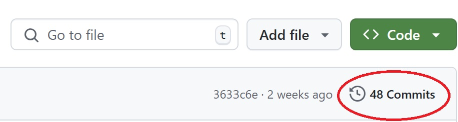
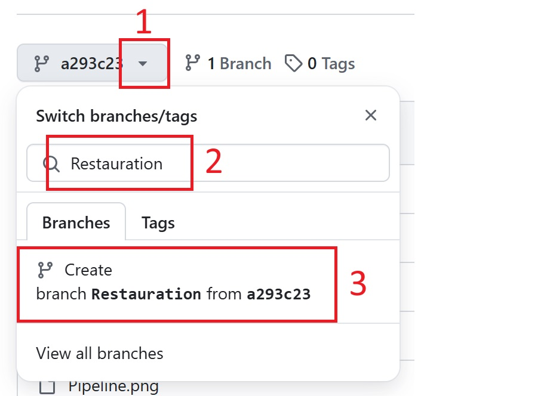
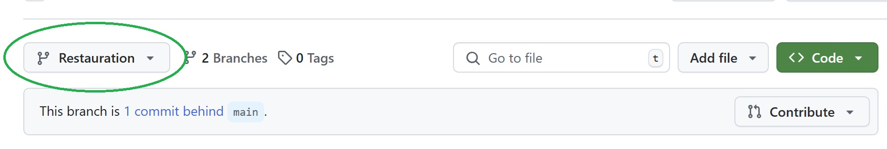
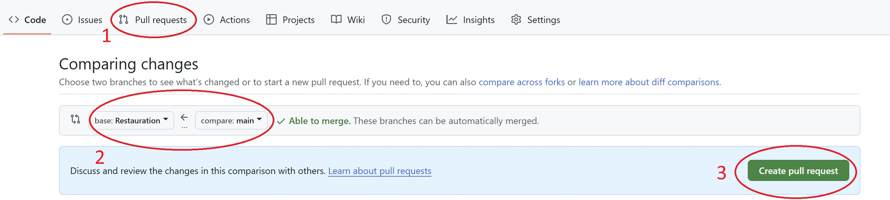

------------------------------------------------------------------------------------------------------
PROCESSUS DE RESTAURATION GITHUB
------------------------------------------------------------------------------------------------------
Suite à une modification de code dans GitHub, votre solution ne fonctionne plus. Vous devez donc restaurer votre code mais comment faire.  

**Exercice :** Ecrire dans ce Readme une procédure pour expliquer étape par étape le processus de restauration d'un code issue de votre historique (vos commits). C'est dire, décivrez comment faire un Checkout depuis l'interfaçe GitHub. Vous trouverez ci-dessous le début de la séquence de restauration.  

-------------------------------------------------------------------------------------------------------
Début de procédure : Historique des commits
-------------------------------------------------------------------------------------------------------
L'historique de vos commits vous donne accès à vos différentes versions de votre code.  
A chaque commit, un point de sauvegarde est créé dans GitHub.  

Cliquez sur Commits pour accèder à votre historique de commits  
  
   

Sélectionnez le sauvegarde que vous souhaitez restaurer.  

   

A présent vous n'êtes plus dans votre branche main (branche principale) mais vous naviguez dans un point de restauration (votre code du passé).  

   

Créez votre nouvelle branche.

   
  
Bravo, vous venez de créer une nouvelle branche.  

  

Pour faire de cette nouvelle branche votre branche principale, vous devez faire un "Pull request".  

Une fois la Pull request faite, il suffira de la merge à main. "And voilà"
